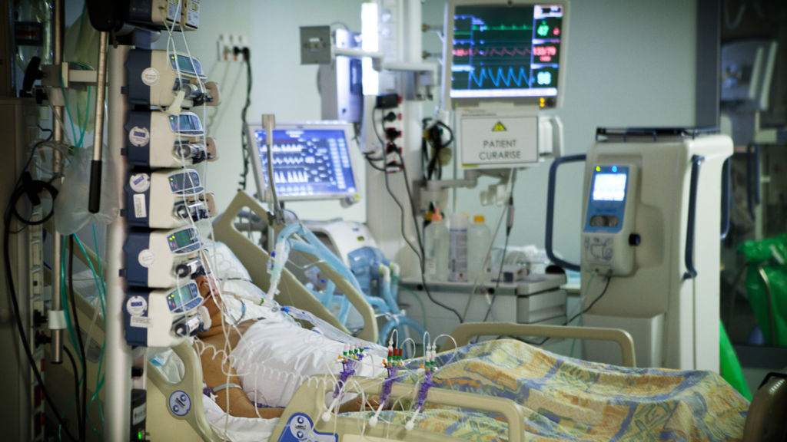

```{r setup, include=FALSE}
knitr::opts_chunk$set(echo = TRUE)

library(tidyverse)
library(lubridate)
library(readxl)
library(janitor)
library(DataEditR)
library(tableone)
library(gt)
library(gtsummary)
library(tableone)
library(bookdown)
library(gridExtra)

```

\


\

# Introduction

This document outlines the exploration of data from the Metavision Electronic Medical Record (EMR) in University Hospital Galway (UHG). The data comes from patients who were: 

- diagnosed with Covid-19
- admitted to the Intensive Care Unit (ICU) of UHG during the period 20/03/2020 - 22/09/2021
- underwent invasive ventilation
- were subject to the prone position while ventilated

The exploration is performed using R 4.1.2 "Bird Hippie". The data is gathered using the 'Metavision Query Wizard'. The query designed for this particular purpose captures all verified data on the system in the areas of:

- patient positioning
- ventilator settings
- cardiovascular measurements
- arterial blood gas values
- haematology blood tests
- biochemical blood tests

Unfortunately, there is no way to effectively query the *amount* of vasoactive agents that the patient is undergoing via infusion using this Query Wizard. It is possible to find out *if* a patient was receiving an infusion, but not the rate. To find this information, one must open each patient record through the normal clinically used interface and manually transcribe it.

## What is 'verified' data?

The Query Wizard can select data from the servers along two key lines. That is, whether the data is 'verified' or 'not verified'. 'Verified' data has been reviewed and approved by a source outside the Metavision system. For most cardiovascular parameters, the nurse at the patient bedside approves a set of readings every hour that are accurate. They also manually enter the ABG data (the point-of-care analysers are not connected to Metavision but can be sourced). Other blood tests are integrated directly into Metavision, having been verified in the hospital laboratory.

Only cardiovascular data seems available in the 'unverified' form. This data is recorded once per minute. The Metavision Query Wizard crashes if one tries to access this data as it attempts to retrieve tens of thousands of pieces of data. It **can** be accessed through SQL queries, but overall this approach is hugely problematic for reasons that will not be covered here.


\

# Data wrangling
## Rationale for wrangling

The data for wrangling before analysis can proceed comes from the Metavision Query Wizard. The filter to generate the output collects essentially all data available. The data is then output as a large, 'untidy' .xls file. In other words, a single column lists all captured parameters and an adjacent column lists the corresponding value.

The data must be anonymised, and transformed to a 'tidy' format @wickham_tidy_2014 before analysis can proceed.

The following steps are identified, and scripts written to accommodate the steps.

\

## Sequence of wrangling

Outlined below is the scripted that the data is passed through in order to create a time-series for all verified data relating to the patient for their entire stay in the ICU. Beside the title of each step is the R script that can be viewed on the [Github](https://github.com/e05bf027/gas_efficiency) accompanying this project.

\
**1. Choose from raw MV Query output files** (source_files.R)

-   view a list available output files
-   choose file to import

```{r source_files.R, eval=FALSE}
# lists all input files in the relevant directory, and asks for your
# selection (which it names 'i'). 'i' will then be used in other scripts.
# =============

# warning to ensure files are pre-processed
print('The .xls files that are generated from the Metavisiion Query wizard')
print('require pre-processing. Have you:')
print('1. changed to extension to .xlsx from .xls?')
print('2. removed the empty rows from the top of the excel file?')
print('====================================================================')
print('If the file(s) has been preprocessed correctly, proceed.')
print('====================================================================')

# List of raw input files
mv_location <- "/Users/davidhannon/Documents/02. Medicine/Med_Programming/00. Patient DB/metavision_outputs"
mv_files <- list.files(mv_location, full.names = TRUE)
view(mv_files)

# choose which file you want to import and process
i <- as.numeric(readline("enter the index of the data file you want to import: "))

# also decide what number you wish to designate for this patient in the final database
j <- as.character(readline('What number do you wish to designate for this patient: '))
file_name <- sprintf('/Users/davidhannon/Documents/02. Medicine/Med_Programming/00. Patient DB/outputs/patient_0%s.xlsx', j)

# ============ CALL NEXT SCRIPT =============
source('demographics.R')

```


\
**2. Enter basic details** (demographics.R)

-   one issue is that certain basic details (height, weight...) are entered inconsistently. The solution is to display what the file contains and then have the user enter the relevant values
-   when the .xlsx file is read in, the patients DOB is coerced to a strange format. The best solution here is to manually open the .xlsx file to get the DOB directly

```{r demographics.R, eval=FALSE}
# this script reads and imports the demographics data for the selected patient.
# it also asks the user to select which admission date they wish to read in.

# Enter the path to the demographics file and import it
demo_file_location <- mv_files[i-1]
demo_df <- read_xlsx(demo_file_location, guess_max = 1000000) %>% 
  clean_names()

# select only parameters of interest
demo_df <- demo_df %>% 
  select(admission_date, parameter_name, value, validation_time) %>% 
  pivot_wider(id_cols = admission_date,
              names_from = parameter_name,
              values_from = value) %>% 
  clean_names()
view(demo_df)

# get DOB and admission date, then calculate patient age
birthday <- dmy(readline('Enter the date of birth (DD-MM-YYYY): '))
admission_date <- ymd_hms(readline('Enter the admission date you wish to process (paste from console): '))
patient_age <- as.integer(time_length(difftime(admission_date, birthday), "years"))

# get inputs for height, weight, gender
patient_height <- as.numeric(readline('Enter the patients height (cm): '))
patient_weight <- as.numeric(readline('Enter the patients weight (kg): '))
patient_gender <- as.character(readline('Enter the patients gender (M/F): '))

# wait for user to CLOSE EXCEL before hitting enter (if Excel is open it will
# cause the total file number to change which creates problems in the next script)
readline(prompt="CLOSE EXCEL, then press [enter] to continue")

# Tidy up
rm(demo_file_location,
   demo_df,
   birthday)

# ======= CALL NEXT SCRIPT =========
source('import_data.R')

```


\
**3. Import and pivot the patient data** (import_data.R)

-   This represents the key step, where the data is pared down and pivoted to a wide format

```{r import_data.R, eval=FALSE}
# Enter the path to the file you want. Must reset mv_files to give full path
metavision_file_specific <- mv_files[i] 

# reads file at that location. guess_max tells the command to look 1000000
# rows into the file, and see what unit format suits best/fits them all
untidy_tibble <- read_xlsx(metavision_file_specific, guess_max = 1000000) %>% 
  filter(`Admission Date` == admission_date)

# now, isolate out only the columns for the parameter name, value, and time
# that the value was recorded
untidy_tibble <-  untidy_tibble %>% 
  select(Time, `Parameter Name`, Value)

# next, factorize the parameter names
untidy_tibble$`Parameter Name` <- as.factor(untidy_tibble$`Parameter Name`)

# The vales in the 'cardiac rhythm;' column are awkward, and often read as
# list_cols. To get around this, isolate the cardiac rhythm values and remove
# them from the larger data frame.
cardiac_rhythm <- filter(untidy_tibble,
                         untidy_tibble$`Parameter Name` == 'Cardiac Rhythm')

untidy_tibble <- filter(untidy_tibble,
                        untidy_tibble$`Parameter Name` != 'Cardiac Rhythm')

# Remove other parameters that are causing an issue with coercion to lists
untidy_tibble <- filter(untidy_tibble,
                        untidy_tibble$`Parameter Name` != 'GCS Eye Response' &
                        untidy_tibble$`Parameter Name` != 'GCS Motor Response' &
                        untidy_tibble$`Parameter Name` != 'GCS Verbal Response' &
                        #untidy_tibble$`Parameter Name` != 'PB Spontaneous  Type' &
                        #untidy_tibble$`Parameter Name` != 'PB Mandatory Mode Type' &
                        untidy_tibble$`Parameter Name` != 'O2 Administration mode' )
                        #untidy_tibble$`Parameter Name` != 'Summary' )

# Now manipulate the cardiac data independently. The initial pivot gives 
# list_cols that are then turned to characters before the original column
# is effectively removed.
cardiac_rhythm <- pivot_wider(cardiac_rhythm, 
                              names_from = `Parameter Name`, 
                              values_from = Value)

cardiac_rhythm$Cardiac_rhythm <- sapply(cardiac_rhythm$`Cardiac Rhythm`, toString)
cardiac_rhythm <- select(cardiac_rhythm, Time, Cardiac_rhythm)

### PIVOT THE UNTIDY TIBBLE INTO WIDE FORMAT and remove the untidy tibble
### replace INIT with the study ID number
tidy_tibble <- pivot_wider(untidy_tibble, 
                           id_cols = Time, 
                           names_from = `Parameter Name`, 
                           values_from = Value)

# Rejoin the cardiac data and arrange everything chronologically
tidy_tibble <- left_join(tidy_tibble, cardiac_rhythm, by = 'Time') %>%
  clean_names() %>% 
  arrange(time)

# add columns for age, height, weight (we will, later, come up with a method
# to designate absent BMI values, and impute them
tidy_tibble$age <- patient_age
tidy_tibble$weight <- patient_weight
tidy_tibble$height <- patient_height
tidy_tibble$gender <- patient_gender

# finally, add a unique identifier for each observation (using datetime objects)
# introduces issues in further scripts
tidy_tibble$observation <- 1:nrow(tidy_tibble)

# Tidy up ================================================================
# checks if there was a height entered for the patient before deleting old
# variables

Sys.sleep(1)

if (tidy_tibble$height[1] > 0) {
  rm(cardiac_rhythm,
     untidy_tibble,
     mv_files,
     mv_location,
     metavision_file_specific,
     i,
     patient_age,
     patient_height,
     patient_weight,
     admission_date,
     patient_gender)
} else {
  rm(cardiac_rhythm,
     untidy_tibble,
     mv_files,
     mv_location,
     metavision_file_specific,
     i,
     patient_age,
     patient_weight,
     admission_date,
     patient_gender)
}

# Call next script =======================================================
source('coerce_datatypes.R')

```


\
**4. Coerce data to useful formats** (coerce_datatypes.R)

-   The data remains entirely in character format. This script separates the dataframe into two. The first is of columns that will remain in character form and the other consists of columns that will be coerced to numeric format to enable analysis and calculation in the future.

```{r coerce_datatypes.R, eval=FALSE}
# this script splits the wide dataframe into two. One will remain in character
# format, but the other has all variables coerced to numeric. They are then 
# rejoined.

# ================= CREATE VECTOR OF VENTILATOR PARAMETERS ================

pb_char <- c('pb_mandatory_mode_type',
             'pb_mode_of_ventilation',
             'pb_spontaneous_type',
             'pb_vent_type',
             'pb_ventilation_mode',
             'set_i_e_ratio_pb',
             'trigger_type_setting')

niv_char <- c('airvo_mode',
              'respironics_mode')

# ================= CREATE VECTOR OF STANDARD PARAMETERS ==================

constant_char <- c('time',
                   'gender',
                   'cardiac_rhythm',
                   'gcs_manual_entry',
                   'patient_positioning',
                   'patient_positioning_abg',
                   'summary')

coerce_char <- c(constant_char, pb_char, niv_char) 
# all variables that might need coercion
rm(constant_char, pb_char, niv_char)

# ==================== COERCE TO NUMERIC ==================================

# create vector of variable names that will be coerced to character, and 
# initialise df
tidy_tibble_char <- select(.data = tidy_tibble, observation)
variables_present <- 'observation'

# select columns that will become character
for (y in 1:length(coerce_char)) {
  if (coerce_char[y] %in% colnames(tidy_tibble)) {
    tidy_tibble_char <-  left_join(tidy_tibble_char,
                                   tidy_tibble[, c('observation', coerce_char[y])],
                                   by = 'observation')
    variables_present <- c(variables_present, coerce_char[y])
  }
}

# remove these columns from the main df (but keep 'observation' for later joining)
tidy_tibble <- select(tidy_tibble, -variables_present, observation)

# use sapply to coerce remaining columns to numeric, then rejoin
tidy_tibble_nums <-  as_tibble(sapply(tidy_tibble[, 1:ncol(tidy_tibble)],
                                        as.numeric))

# reform tidy_)tibble by joining the coerced and character dfs
tidy_tibble <-  full_join(tidy_tibble_char, tidy_tibble_nums, by = 'observation')

# tidy up
rm(coerce_char, variables_present, tidy_tibble_char, tidy_tibble_nums)

# ==================== CALL NEXT SCRIPT =======================
source('add_new_gas_indices.R')

```


\
**5. BMI** (BMI_processing.R)

-   This script calculates the patients BMI after checking if a height and weight has been recorded for the patient. If no height is recorded, the column is created but populated with NAs.

-   Also creates a new column to show if the data necessary to record BMI was present. This is in anticipation of using techniques to impute NAs with other values (it will show if the value is imputed or actual)

```{r BMI_processing.R, eval=FALSE, collapse=TRUE}
# This script calculates the BMI of the patient if their height and weight is
# available. It also adds a column indicating if their height is present in the
# original dataset.

if (!is.na(tidy_tibble$height[1])) {
  tidy_tibble <- mutate(tidy_tibble, 
         BMI = weight / ((height/100)^2),
         height_recorded = TRUE)
} else {
  tidy_tibble <- mutate(tidy_tibble,
         BMI = NA,
         height_recorded = FALSE)
}

#====== NEXT SCRIPT ==========
source('create_subtibbles.R')

```


\
**6. Divide the data into groups** create_subtibbles.R

- This script isolates certain specific groups of variables and places the dfs in a list that can be later used to populate sheets in a .xlsx output

- Future work will need to incorporate a step where the user specifies which ventilator the patient was using when undergoing invasive ventilation. For the Covid-19 patients this is always the Puritan Bennett model by Medtronic, but if patients before this time period are added, there are seversal other ventilators in use.

```{r create_subtibbles.R, eval=FALSE}
# Create subtibbles
# 1. demographics
demo_tibble <- tidy_tibble %>% 
  select(age,
         gender,
         weight,
         height_recorded,
         BMI)

if (!is.na(tidy_tibble$height[1])) {
  demo_tibble$height <- tidy_tibble$height
}

demo_tibble <- demo_tibble[1,]

# 2. ABG
ABG_tibble <- tidy_tibble %>% 
  select(time,
         patient_positioning,
         patient_positioning_abg,
         ph_abg,
         pa_o2,
         pa_co2,
         bicarbonate_abg_a,
         lactate_abg,
         base_excess_vt,
         potassium_abg,
         sodium_abg,
         anion_gap_abg,
         glucose_abg,
         total_haemoglobin,
         fi_o2,
         tympanic_temperature,
         sa_o2_systemic,
         sp_o2)

# 3. ventilator
pb_variables <- c('time',
                  'patient_positioning',
                  'fi_o2',
                  'set_fraction_inspired_oxygen_pb',
                  'end_tidal_co2_marquette',
                  'pb_mode_of_ventilation',
                  'set_respiratory_rate_pb',
                  'set_tv_pb',
                  'set_peep_pb',
                  'peep',
                  'set_i_e_ratio_pb',
                  'minute_volume_pb',
                  'measured_fi02_pb',
                  'measured_peep_pb',
                  'total_respiratory_rate_pb',
                  'expiratory_tidal_volume_pb',
                  'peak_inspiratory_pressure_measured_pb',
                  'plateau_airway_pressure_pb',
                  'mean_airway_pressure_pb',
                  'peak_inspiratory_pressure_measured_pb',
                  'dynamic_characteristics_pb',
                  'peak_flow_vmax_pb',
                  'pb_mandatory_mode_type',
                  'pb_spontaneous_type',
                  'pb_vent_type',
                  'pb_ventilation_mode',
                  'set_i_of_i_e_ratio',
                  'set_eof_i_e_ratio')

vent_tibble <- tibble(observation = tidy_tibble$observation)
for (k in 1:length(pb_variables)) {
  if (pb_variables[k] %in% colnames(tidy_tibble)) {
    vent_tibble <- left_join(vent_tibble, 
              tidy_tibble[, c('observation', pb_variables[k])],
              by = 'observation')
  }
}

# 4. Cardiovascular
# The initial columns always exist, after that we must check if cardiac output
# columns exist, and then select them.
cardio_tibble <- tidy_tibble %>% 
  select(time,
         patient_positioning,
         cardiac_rhythm,
         heart_rate,
         arterial_pressure_systolic,
         arterial_pressure_diastolic,
         arterial_pressure_mean,
         non_invasive_arterial_pressure_systolic,
         non_invasive_arterial_pressure_diastolic,
         non_invasive_arterial_pressure_mean)

# check if advanced CO parameters are present and add them if they do
adv_co <- c('central_venous_pressure',
            'sv_o2_venous',
            'cardiac_output)_vigileo',
            'stroke_volume_vigileo',
            'stroke_volume_variation_vigileo',
            'systemic_vascular_resistance_vigileo')

for (z in 1:length(adv_co)) {
  if (adv_co[z] %in% colnames(tidy_tibble)) {
    left_join(cardio_tibble, 
              tidy_tibble[, c('time', adv_co[z])],
              by = 'time')
  }
}

# the final step is to create a list of these that will be passed to the
# write.xlsx function to give a file with different output sheets
all_data <- select(tidy_tibble,
                   -summary) # remove data that could hold sensitive info
  
output_sheets <- list(demographics = demo_tibble,
                      ABG = ABG_tibble,
                      Ventilator = vent_tibble,
                      Cardiovascular = cardio_tibble,
                      All_recorded = all_data)

# tidy up
rm(demo_tibble,
   ABG_tibble,
   pb_variables,
   vent_tibble,
   cardio_tibble,
   adv_co,
   k,
   y,
   z)

# next script
source('file_outputs.R')

```


\
**7. Save output .xlsx files** file_outputs.R

- This script saves the anonymised wrangled data as a .xlsx file to the hard drive, and also uploads a copy to google drive.

```{r file_outputs.R, eval=FALSE}
# This output consists of:
# 1. saving .xlsx of all data to disk
# 2. generating a version of the file for Warwick and saving this to googledrive

# Save a copy of the file
write_xlsx(x = output_sheets, format_headers = T, path = file_name)

# Save the tibble
save(tidy_tibble, file = sprintf('/Users/davidhannon/Documents/02. Medicine/Med_Programming/00. Patient DB/dfs/patient_0%s.Rda', j))

# upload a copy to google drive
# NB: 'drive_put' allows the file to either renew an existing file,
# or placing a brand new file
local_location <- file_name
drive_location <- as_dribble('https://drive.google.com/drive/folders/1SnxmvqQnWsjr5jjSWFY5ht9FOpsi5fkg')
drive_put(local_location, drive_location)

# tidy
rm(all_data, 
   output_sheets, 
   drive_location,
   local_location,
   j,
   file_name)

```


\
This represents my approach to wrangling the data to create a time-series for the admision of each patient. I have now designed a filter for the Metavision Query Wizard output that captures essentially any data we have available, with the caveatd mentioned above.

\

# Assembling the final dataframe
## Basic assembly

Due to the subtleties and high amount of individual variation between the time-series for each patient, the next step involves manually selecting parameters that are assembled into an overall dataframe which is an amalgame of key moments from each patient. For each patient, we have the following recorded each time the patient is placed in the prone position:

- an ABG, ventilator settings, and cardiovascular readings within 3 hours of moving to the prone position
- the same observations within 3 hours post moving to the prone position
- the same observations within 3 hours of moving back to the supine position
- the same within 3 hours after returning to the supine position

It should be noted that the ABG data is transcribed to Metavision by the nurse at the bedside, so it subject to error. The full data is available from the analyser if needed, but an inspection of five cases has shown the manually entered data to be accurate. A small piece of the resulting frame is visible below.

\

```{r load_xlsx, echo=FALSE, message=FALSE, warning=FALSE}

path <- ('/Users/davidhannon/Documents/02. Medicine/Med_Programming/00. Patient DB/around_proning_for_ML/first_prone_GUH.xlsx')
prone_data <- read_xlsx(path = path, guess_max = 100)

head(prone_data[, c(2, 15, 20:24)])

```

\

## Coercing variables

Some variables must be coerced from characters to factors, and integers, to optimize later analysis.

```{r coerce_variables, eval=TRUE, include=TRUE}
prone_data$patient_id <- as.factor(prone_data$patient_id)
prone_data$gender <- as.factor(prone_data$gender)
prone_data$outcome <- as.factor(prone_data$outcome)
prone_data$patient_positioning <- as.factor(prone_data$patient_positioning)
prone_data$proning_sequence <- factor(prone_data$proning_sequence, 
                                      levels = c('pre_prone',
                                                 'post_prone',
                                                 'pre_unprone',
                                                 'post_unprone'))
prone_data$location_preadmission <- as.factor(prone_data$location_preadmission)
prone_data$total_proning <- as.integer(prone_data$total_proning)
prone_data$proning_session <- as.integer(prone_data$proning_session)
```

\

# The observed population

One final step is to calculate the BMI for each patient. The patient height is often missing from the Metavision system. If this is unavailable, Intensive Care National Audit & Research Centre (ICNARC) convention assumes 175cm for males, 165cm for females. The final result for the obeserved population is shown below. Note that this is a work in progress, and will be expanded upon with each further trip to UHG.

```{r bmi, eval=TRUE, include=TRUE}
prone_data <- prone_data %>% 
  mutate(bmi = round(weight / (height/100)^2, 1))
```

```{r isolate_summarise_population, echo=FALSE}

# isolate data concerning demographics
prone_data_pop <- prone_data %>%
  select(gender, 
         age, 
         weight, 
         height, 
         bmi, 
         # apache_ii, # ADD THIS AFTER NEXT UHG TRIP
         total_proning,
         location_preadmission,
         los, 
         outcome) %>% 
  distinct()

```

```{r gtsummary_table_1_creation, include=FALSE}
# theme_gtsummary_journal(journal = "jama")
# Setting theme `JAMA`

theme_gtsummary_compact()
# Setting theme `Compact`

table_1 <- prone_data_pop %>% 
  tbl_summary(
    statistic = list(all_continuous() ~ "{mean} ({sd})",
                     all_categorical() ~ "{n} / {N} ({p}%)"),
    digits = all_continuous() ~ 1,
    label = list(gender ~ "Gender", 
                 age ~ "Age (years)",
                 weight ~ "Weight (kg)",
                 height ~ "Height (cm)",
                 bmi ~ "BMI",
                 # apache_ii ~ "Apache II",
                 total_proning ~ "Total proning sessions",
                 location_preadmission ~ "Admitting location",
                 los ~ "Length of stay (days)",
                 outcome ~ "Outcome")
  ) %>% 
  # modify_caption("**Table 1. Patient Characteristics**") %>% 
  bold_labels() %>% 
  modify_footnote(
    all_stat_cols() ~ "Mean (SD) or Frequency (%)
    "
  ) %>% 
  as_gt() %>% 
  gt::tab_source_note(gt::md("**NB APACHE II scores will be added shortly**"))

```

\

See Table 1 for a population overview.

\

```{r table_1 display, echo=FALSE}
# code to display table one is a separate chunk as there is an unusual output whenever a theme is set `9as in the top of the above code chunk)
table_1
```
\

# Calculation of new indices
## Surrogate markers for mechanical power
### Overview

Mechanical power is a difficult measure to calculate with the data we have available. There are approximately five ways to calculate mechanical power @chi_progress_2020 under volume control ventilation. Unfortunately, all of these methods require either peak flow (Vmax) or plateau pressure (PPlat). The available data does not have PPlat, and due to oversights in the connection between the PB ventilator and the Metavision servers, Vmax is always recorded as 0.

The two surrogate markers we can use to get some in sight into this are:

- Peak Inspiratory Pressure (PIP)
- Dynamic compliance (Cdyn)

Luckily, these are automatically recorded by the ICU ventilator and are within the data we have access to.

\

### Changes in PIP

We can very roughly visualize PIP in the supine vs prone positions.

\

```{r pip_by_stage, echo=FALSE}
# create summary df
pip_prone_supine <- prone_data %>% 
  select(proning_sequence, 
         peak_inspiratory_pressure_measured_pb.x) %>%
  group_by(proning_sequence) %>% 
  summarise(pip_mean = mean(peak_inspiratory_pressure_measured_pb.x, na.rm = T),
            pip_sd = sd(peak_inspiratory_pressure_measured_pb.x, na.rm = T))

# create gt table
pip_prone_supine %>% rename(
  'PIP mean (cmH2O)' = pip_mean,
  'PIP SD (cmH2O)' = pip_sd,
  'Proning stage' = proning_sequence
  ) %>% 
  gt() %>% 
  tab_header(
      title = md("**PIP in different positions**")
    ) %>% 
  cols_align(
    align = c('left'),
    columns = 'Proning stage'
  ) %>% 
  cols_align(
    align = c('center'),
    columns = 2:3
    ) %>% 
  fmt_number(
    columns = 2:3,
    decimals = 1
  ) %>% 
  tab_source_note(
    source_note = md("*Source: data described in Table 1*")
  )

```

\

There is essentially no difference between the prone and supine positions when examined this way, and can conclude that PIP does **not meaningfully change around prone positioning** in this cohort.
   
\

### Changes in Paw

Mean airway pressure (Paw) is the average pressure on the whole of the respiratory system over the whole of the respiratory cycle. It is therefore the average pressure applied over the entire respiratory cycle. Under most normal circumstances, mean airway pressure correlates well with mean alveolar pressure, and is usually close to the PEEP value. Mean airway pressure differs significantly from mean alveolar pressure when there is significant airflow restriction (eg. bronchospasm) and where there is significant intrinsic PEEP @marini_mean_1992. 

\

```{r paw_table, echo=FALSE}
# create summary df
paw_prone_supine <- prone_data %>% 
  select(proning_sequence, 
         mean_airway_pressure_pb) %>%
  group_by(proning_sequence) %>% 
  summarise(Paw_mean = mean(mean_airway_pressure_pb, na.rm = T),
            Paw_sd = sd(mean_airway_pressure_pb, na.rm = T))

# create gt table
paw_prone_supine %>% rename(
  'Paw mean (cmH2O)' = Paw_mean,
  'Paw SD (cmH2O)' = Paw_sd,
  'Proning stage' = proning_sequence
  ) %>% 
  gt() %>% 
  tab_header(
      title = md("**Paw in different positions**")
    ) %>% 
  cols_align(
    align = c('left'),
    columns = 'Proning stage'
  ) %>% 
  cols_align(
    align = c('center'),
    columns = 2:3
    ) %>% 
  fmt_number(
    columns = 2:3,
    decimals = 1
  ) %>% 
  tab_source_note(
    source_note = md("*Source: data described in Table 1*")
  )

```

\

There is a small mean decrease in Paw over the course of the prone position, but is similar to PIP and does not appear meaningful or significant.

\

### Changes in Cdyn

We will explore a similar exploration to that of PIP. We will begin by examining the changes at each stage.

\

```{r Cdyn_table, echo=FALSE, warning=FALSE}
# create summary df
cdyn_prone_supine <- prone_data %>% 
  select(proning_sequence, 
         dynamic_characteristics_pb) %>%
  group_by(proning_sequence) %>% 
  summarise(cdyn_mean = mean(dynamic_characteristics_pb, na.rm = T),
            cdyn_sd = sd(dynamic_characteristics_pb, na.rm = T))

# create gt table
cdyn_prone_supine %>% rename(
  'Cdyn mean (mL/cmH2O)' = cdyn_mean,
  'Cdyn SD (mL/cmH2O)' = cdyn_sd,
  'Proning stage' = proning_sequence
  ) %>% 
  gt() %>% 
  tab_header(
      title = md("**Cdyn in different positions**")
    ) %>% 
  cols_align(
    align = c('left'),
    columns = 'Proning stage'
  ) %>% 
  cols_align(
    align = c('center'),
    columns = 2:3
    ) %>% 
  fmt_number(
    columns = 2:3,
    decimals = 1
  ) %>% 
  tab_source_note(
    source_note = md("*Source: data described in Table 1*")
  )

```
\

We can see here that on average there is an approximately 10% improvement in Cdyn from before to after each proning manoeuvre, with an accompanying increase in the SD. Overall, there is little meaningful change in this parameter.

\

## Indices of oxygenation
### Overview

There are several indices of oxygenation to examine in terms of how they change over the course of prone positioning. See more details at [Life In The Fast Lane](https://litfl.com/pao2-fio2-ratio/) for an overview. For example:

- PF ratio
- Oxygen saturations in arterial blood (SpO2 and SaO2)
- S/F ratio (SpO2 to FiO2 ratio)
- PaO2 (arterial oxygen tension)
- A-a gradient (difference between alveolar oxygen tension (PAO2) and PaO2)
- Oxygenation index (OI) (the reciprocal of P/F times mean airway pressure (MAP)
- P/FP Ratio (PaO2/(FiO2 X PEEP)
- Respiratory index (RI) (RI = pO2(A-a)/pO2(a), ie. the A-a gradient divided by the PaO2; normal RI is <0.4)
- ventilatory ratio
- arterial O2 content (CaO2)

In this section we will perform a rough analysis in the different positions relative to proning, similar to exploring our surrogate markers for mechanical power. We will also compare the differences in these indices between patients who lived to discharge, and those who died during their admission. In order to calculate all indices, we must first calculate the predicted body weight (PBW) for the patient based on their height. PBW (kg) is calculated using the formula 50+0.91 (height – 152.4) for males, and 45.5+0.91 (height–152.4) for females @brower_ventilation_2000.


```{r calculate_pbw, include=FALSE, results='hide'}

# the df is split into male and female, the mutation applied to each table, and then the results combined
prone_m <- filter(prone_data, gender == 'm') %>% 
  mutate(predicted_weight = 50 + (0.91 * (height - 152.4)))

prone_f <- filter(prone_data, gender == 'f') %>% 
  mutate(predicted_weight = 45.5 + (0.91 * (height - 152.4)))

prone_data <- bind_rows(prone_f, prone_m) %>% 
  arrange(patient_id, obs_time)

round(prone_data$predicted_weight, 1)

# remove redundant dfs
rm(prone_m, prone_f, path)

```

The median number of times a person who is discharged from the ICU is 4, whereas for those who died it is 6. No definite conclusions can be drawn from this other than to say the lungs of those who died are not as responsive to proning, for whatever reason. Let's quickly look at a graphical representation of differences in some measures of oxygenation between patients who died during their admission, and those who survived.

```{r median_prones, include=FALSE}

dc_median_prone <- prone_data %>% 
  filter(outcome == "DC") %>% 
  summarise(dc_median = median(total_proning)) %>% 
  print()

rip_median_prone <- prone_data %>% 
  filter(outcome == "RIP") %>% 
  summarise(rip_median = median(total_proning)) %>% 
  print()

```

```{r calc_indices oxygenation, include=FALSE, results='hide'}
## aa gradient
prone_data <- prone_data %>% 
  mutate(aa_gradient_pAco2 = 
           ((fi_o2 * (101.3 - 6.3)) - (end_tidal_co2_marquette / 0.8)) - pa_o2,
         aa_gradient_paco2 = 
           ((fi_o2 * (101.3 - 6.3)) - (pa_co2 / 0.8)) - pa_o2)

round(prone_data$aa_gradient_pAco2, 1)
round(prone_data$aa_gradient_paco2, 1)


# pf ratio
prone_data <- prone_data %>% 
  mutate(pf_ratio = pa_o2 / fi_o2)

round(prone_data$pf_ratio, 1)


#cao2
prone_data <- prone_data %>% 
  mutate(ca_o2 = (1.34 * total_haemoglobin * (sa_o2_systemic/100)) + (0.0225 * pa_o2))

round(prone_data$ca_o2, 1)


# ventilatory ratio
prone_data <- prone_data %>% 
  mutate(ventilatory_ratio = expiratory_tidal_volume_pb * pa_co2 / (100 * predicted_weight) * 5)

round(prone_data$ventilatory_ratio, 2)


# sf ratio
prone_data <- prone_data %>% 
  mutate(
    sf_ratio = sp_o2 / fi_o2
  )

round(prone_data$sf_ratio, 0)


## oxygenation index (OI)
# note: Paw * 0.74 converts cmH2O to mmHg
# pa_o2 * 7.5 converts kPa to mmHg
prone_data <- prone_data %>% 
  mutate(
    oxy_index = 
      (fi_o2 * 100) * (mean_airway_pressure_pb * 0.74) / (pa_o2 * 7.5)
  )

round(prone_data$oxy_index, 1)


## pfp ratio
# NB - I think the authors use imperial units but this is unclear
prone_data <- prone_data %>% 
  mutate(
    pfp_ratio = pa_o2 / fi_o2 * peep
  )

round(prone_data$pfp_ratio, 0)


# oxygenation factor
prone_data <- prone_data %>% 
  mutate(
    oxy_factor = pa_o2 / fi_o2 * mean_airway_pressure_pb
  )

round(prone_data$oxy_factor, 1)
```

```{r split_df, echo=FALSE}
# split the prone data frame into living and dead
prone_rip <- prone_data %>% 
  filter(outcome == 'RIP')

prone_dc <- prone_data %>% 
  filter(outcome == 'DC')
```

\

### Exploration of indices

This section will include very rough and high level explorations of the data in order to get a feel for what has been captured in the dataset. At this point, we can be curious about who lived and who died as an outcome.

\

##### FiO2

An initial overview of the recorded fio2 values for those who lived vs those who died shows, perhaps unsurprisingly, that patients who did not survive tended to be administered a higher FiO2.

\

```{r rough_fio2, echo=FALSE}
prone_data %>% 
  ggplot(
    mapping = aes(x = patient_id, y = fi_o2, col = outcome)
  ) +
  geom_boxplot(
    na.rm = T
  ) +
  theme(
    axis.text.x = element_text(
      angle = 90
      ),
    axis.title.x = element_text(
      face = 'bold'
      ),
    axis.title.y = element_text(
      face = 'bold'
      )
    ) +
  xlab('Patient') +
  ylab('FiO2')
```
\

#### PaO2

A similar pattern is seen when looking at pao2 values. The very strong outlier values likely represent times when the fio2 was set to 1.0 around prone positioning, or very effective responses to prone positioning that necessitated a downward titration of fio2 but were not noted until an ABG was performed some time after proning.

\

```{r rough_pao2, echo=FALSE}
prone_data %>% 
  ggplot(
    mapping = aes(
      x = patient_id, 
      y = pa_o2, 
      col = outcome
      )
  ) +
  geom_boxplot(
    na.rm = T
  ) +
  theme(
    axis.text.x = element_text(
      angle = 90
      ),
    axis.title.x = element_text(
      face = 'bold'
      ),
    axis.title.y = element_text(
      face = 'bold'
      )
    ) +
  xlab('Patient') +
  ylab('paO2')
```

\

We can also look at what FiO2 is needed to produce a certain PaO2. In the plot below, we can see a general trend towards patients who do not survive requiring a higher FiO2 to achieve a satisfactory PaO2, though there is no clear-cut point that denotes a transition. Most values for PaO2 seem to be in the range 8-16kPa.

\

```{r fio2_vs_pao2, echo=FALSE}
prone_data %>% 
  ggplot(mapping = 
           aes(
             x = fi_o2, 
             y = pa_o2,
             col = outcome
             )
         ) +
  geom_jitter(
    na.rm = T, 
    width = 0.006
    ) +
  theme(
    axis.title.x = element_text(
      face = 'bold'
      ),
    axis.title.y = element_text(
      face = 'bold'
      )
    ) +
  scale_x_continuous(
    name = 'FiO2', 
    limits = c(0.25, 1.0), 
    breaks = seq(0.25, 1.0, 0.05)
    ) +
  scale_y_continuous(
    name = 'PaO2 (kPa)', 
    limits = c(5, 35), 
    breaks = seq(5, 35, 5)
  )

```


\

#### PF ratio

Assesses lung function, particularly useful for intubated patients @horovitz_pulmonary_1974. It uses the following equation:

\

$$ PFR = PaO_2 / FiO_2     $$

\
A graphical comparison between patients who lived to discharge, and those who died, gives the following:

\

```{r pfr_compare, echo=FALSE}
pfr_dc <- prone_dc %>% 
  ggplot(
    mapping = aes(
      x = proning_sequence,
      y = pf_ratio,
      col = patient_positioning
    )
  ) + 
  geom_boxplot(na.rm = T) +
  xlab('Position') +
  scale_y_continuous(
    limits = c(5, 55),
    breaks = seq(0, 55, 10),
    name = 'PF ratio'
  ) +
  labs(col = 'Position') +
  theme_grey()  +
  ggtitle('Changes in PFR (survived to DC)')+
  theme(legend.position = 'bottom') 

pfr_rip <- prone_rip %>% 
  ggplot(
    mapping = aes(
      x = proning_sequence,
      y = pf_ratio,
      col = patient_positioning
    )
  ) + 
  geom_boxplot(na.rm = T) +
  xlab('Position') +
  scale_y_continuous(
    limits = c(5, 55),
    breaks = seq(0, 55, 10),
    name = 'PF ratio'
  ) +
  labs(col = 'Position') +
  theme_grey() +
  ggtitle('Changes in PFR (RIP)') +
  theme(legend.position = 'bottom') 

grid.arrange(pfr_dc, pfr_rip, ncol = 2)
```

\

It can be seen that among those who survived, there is a more marked increase in PFR than among those patients that died. It also appears that those who die have a lower PFR before proning, on average, and this PF ratio changes less following being placed in the prone position but does still improve. There is a greater spread in the PF ratio values following the change to the prone position, so is it possible that some people 'respond' and then stop responding?

\

#### Oxygenation Factor (OF)

This measure was proposed initially as a way to reflect shunting in patients undergoing open heart surgery @el-khatib_new_2004. It incorporates Paw and is a strong reflection of major ARDS mortality indicators such as mechanical power, driving pressure, and static lung compliance @el-khatib_comparison_2020. This measures has the advantage that it incorporates mechanical ventilation settings. In essence this measure 'normalizes' the PF ratio.

In theoretical terms, this is the measure available to me that feels the most promising. It is calculated with the following formula:

\

$$ OF = \frac{PaO_2 / FiO_2}{P_{AW}}  $$
\

```{r of_compare, echo=FALSE}
of_dc <- prone_dc %>% 
  ggplot(
    mapping = aes(
      x = proning_sequence,
      y = oxy_factor,
      col = patient_positioning
    )
  ) + 
  geom_boxplot(na.rm = T) +
  xlab('Position') +
  scale_y_continuous(
    limits = c(0, 800),
    breaks = seq(0, 800, 100),
    name = 'Oxygenation Factor'
  ) +
  labs(col = 'Position') +
  theme_grey()  +
  ggtitle('Changes in OF (survived to DC)')+
  theme(legend.position = 'bottom') 

of_rip <- prone_rip %>% 
  ggplot(
    mapping = aes(
      x = proning_sequence,
      y = oxy_factor,
      col = patient_positioning
    )
  ) + 
  geom_boxplot(na.rm = T) +
  xlab('Position') +
  scale_y_continuous(
    limits = c(0, 800),
    breaks = seq(0, 800, 100),
    name = 'Oxygenation Factor'
  ) +
  labs(col = 'Position') +
  theme_grey() +
  ggtitle('Changes in OF (RIP)') +
  theme(legend.position = 'bottom') 

grid.arrange(of_dc, of_rip, ncol = 2)

```

\

We see a pattern very much like that seen when analyzing PFR, which makes sense given how mathematically similar they are.

\

#### Ventilatory ratio

The ventilatory ratio (VR) compares actual measurements and predicted values of minute ventilation and PaCO2. It provides a unitless ratio that can be easily calculated at the bedside. VR is governed by carbon dioxide production and ventilatory efficiency in a logically intuitive way @sinha_ventilatory_2009. The VR was originally proposed over a decade ago. In it's original form, the VR is calculated as follows:

\

$$ VR = \frac{\dot{V}_\text{Emeasured} * PaCO_2}{100 * PBW * 5} $$

In this equation, VR is the ventilatory ratio (where close to 1 is considered 'normal'), VE is *minute volume*, PaCO2 is the *partial pressure of CO2* given in an arterial blood gas (ABG). PaCO2 predicted is considered to be 5kPa.

\

```{r echo=FALSE}
vr_dc <- prone_dc %>% 
  ggplot(
    mapping = aes(
      x = proning_sequence,
      y = ventilatory_ratio,
      col = patient_positioning
    )
  ) + 
  geom_boxplot(na.rm = T) +
  xlab('Position') +
  scale_y_continuous(
    limits = c(0, 3.5),
    breaks = seq(0, 3.5, 1),
    name = 'Ventilatory Ratio'
  ) +
  labs(col = 'Position') +
  theme_grey()  +
  ggtitle('Changes in VR (survived to DC)')+
  theme(legend.position = 'bottom') 

vr_rip <- prone_rip %>% 
  ggplot(
    mapping = aes(
      x = proning_sequence,
      y = ventilatory_ratio,
      col = patient_positioning
    )
  ) + 
  geom_boxplot(na.rm = T) +
  xlab('Position') +
  scale_y_continuous(
    limits = c(0, 3.5),
    breaks = seq(0, 3.5, 1),
    name = 'Ventilatory Ratio'
  ) +
  labs(col = 'Position') +
  theme_grey() +
  ggtitle('Changes in VR (RIP)') +
  theme(legend.position = 'bottom') 

grid.arrange(vr_dc, vr_rip, ncol = 2)
```

\

The observed differences with ventilatory ratio are much less impressive and there are more extreme outliers. Let's finally look at A-a gradient.

\

#### A-a O2 gradient

This index assesses for degree of shunting and V/Q mismatch, first proposed over 40 years ago @helmholz_abbreviated_1979. It is calculated as follows:

\

$$ \text{A-a O}_2 \text{ gradient} = [(FiO_2) * (P_\text{atm} - P_\text{H2O}) - pA_\text{CO2} / 0.8)] -  pa_O2 $$
\

```{r echo=FALSE}
aa_dc <- prone_dc %>% 
  ggplot(
    mapping = aes(
      x = proning_sequence,
      y = aa_gradient_paco2,
      col = patient_positioning
    )
  ) + 
  geom_boxplot(na.rm = T) +
  xlab('Position') +
  scale_y_continuous(
    limits = c(0, 90),
    breaks = seq(0, 90, 10),
    name = 'A-a O2 gradient'
  ) +
  labs(col = 'Position') +
  theme_grey()  +
  ggtitle('Changes in Aa gradient (survived)')+
  theme(legend.position = 'bottom') 

aa_rip <- prone_rip %>% 
  ggplot(
    mapping = aes(
      x = proning_sequence,
      y = aa_gradient_paco2,
      col = patient_positioning
    )
  ) + 
  geom_boxplot(na.rm = T) +
  xlab('Position') +
  scale_y_continuous(
    limits = c(0, 90),
    breaks = seq(0, 90, 10),
    name = 'A-a O2 gradient'
  ) +
  labs(col = 'Position') +
  theme_grey() +
  ggtitle('Changes in Aa gradient (RIP)') +
  theme(
    legend.position = 'bottom') 

grid.arrange(aa_dc, aa_rip, ncol = 2)
```

\

In this case we see a similar pattern in inverse. However, it appears that thr absolute reduction in Aa gradient is similar between those who survived and those who did not, but the baseline Aa gradient is higher in those who did not survive.

\

## Response to proning
### Classifying response

The response of patients to being placed in the prone position can also be classified. Langer at al. classified patients as _Oxygen Responders_ or _Carbon Dioxide Responders_ in a 2021 paper @langer_prone_2021. A patient was designated as an “O2-Responder”, if they had an increase in the PFR of ≥ 2.67kPa (20 mmHg) during prone ventilation as compared to baseline values in supine position. Patients were defined as “CO2-Responders”, if their Ventilatory Ratio (VR) was reduced during prone ventilation, as compared to baseline values in supine position.

In order to examine this we will create a new df.

```{r create_prone_response_df, echo=TRUE}
prone_df_response <- prone_data %>% 
  select(
    c(1:5, 7, 9, 10, 65, 12, 13, 15:18, 67, 69, 70, 71, 73, 75)
    )
```

\

New variables will be added to this df. These will be:

- whether the patient was 'oxygen responsive' during that proning session
- what the change in PFR was in the session
- whether the patient was 'carbon dioxide responsive' 
- what the change in VR was in the session

```{r add_response_vars, echo=FALSE}
# we isolate only the variables we are interested in before pivoting the table wider and then calculating the needed variables regarding pfr (o2) response
prone_pfr_response <- prone_data %>% 
  select(
    patient_id,
    bmi,
    proning_session,
    proning_sequence,
    pf_ratio,
    outcome
  ) %>% 
  filter(
    proning_sequence != 'post_prone' & proning_sequence != 'post_unprone'
  ) %>% 
  pivot_wider(
    names_from = proning_sequence,
    values_from = pf_ratio
  ) %>% 
  mutate(
    pfr_change = pre_unprone - pre_prone,
    o2_responder = pfr_change > 2.67
  ) %>% 
  rename(
    'pfr_pre_prone' = 'pre_prone',
    'pfr_pre_unprone' = 'pre_unprone'
  )

prone_pfr_response$id_col <- 1:nrow(prone_pfr_response) # adds unique col for later joining

# repeat the above for ventilatory ratio ============================================
prone_vr_response <- prone_data %>% 
  select(
    patient_id,
    proning_session,
    proning_sequence,
    ventilatory_ratio,
    outcome
  ) %>% 
  filter(
    proning_sequence != 'post_prone' & proning_sequence != 'post_unprone'
  ) %>% 
  pivot_wider(
    names_from = proning_sequence,
    values_from = ventilatory_ratio
  ) %>% 
  mutate(
    vent_ratio_change = pre_unprone - pre_prone,
    co2_responder = vent_ratio_change > 0
  )%>% 
  rename(
    'vent_ratio_pre_prone' = 'pre_prone',
    'vent_ratio_pre_unprone' = 'pre_unprone'
  )

prone_vr_response$id_col <- 1:nrow(prone_vr_response) # adds unique col for later joining

# repeat for aa gradient =====================================================
prone_aA_response <- prone_data %>% 
  select(
    patient_id,
    bmi,
    proning_session,
    proning_sequence,
    aa_gradient_pAco2,
    outcome
  ) %>% 
  filter(
    proning_sequence != 'post_prone' & proning_sequence != 'post_unprone'
  ) %>% 
  pivot_wider(
    names_from = proning_sequence,
    values_from = aa_gradient_pAco2
  ) %>% 
  mutate(
    aA_grad_change = pre_unprone - pre_prone
  )%>% 
  rename(
    'aA_grad_pre_prone' = 'pre_prone',
    'aA_grad_pre_unprone' = 'pre_unprone'
  )

prone_aA_response$id_col <- 1:nrow(prone_aA_response) # adds unique col for later joining

# repeat for aa gradient =======================================================
prone_oxy_factor_response <- prone_data %>% 
  select(
    patient_id,
    bmi,
    proning_session,
    proning_sequence,
    oxy_factor,
    outcome
  ) %>% 
  filter(
    proning_sequence != 'post_prone' & proning_sequence != 'post_unprone'
  ) %>% 
  pivot_wider(
    names_from = proning_sequence,
    values_from = oxy_factor
  ) %>% 
  mutate(
    oxy_factor_change = pre_unprone - pre_prone
  )%>% 
  rename(
    'oxy_factor_pre_prone' = 'pre_prone',
    'oxy_factor_pre_unprone' = 'pre_unprone'
  )

prone_oxy_factor_response$id_col <- 1:nrow(prone_aA_response) # adds unique col for later joining

# =================================================================================

## amalgamate the dataframes
# 1 - prone_vr_response
# 2 - prone_pfr_response
# 3 - prone_aA_response
# 4 - prone_oxy_factor_response

indices_response <- right_join(
  x = prone_pfr_response,
  y = prone_vr_response[, 4:8],
  by = 'id_col'
  )

# join aa table 
indices_response <- right_join(
  x = indices_response,
  y = prone_aA_response[, 5:8],
  by = 'id_col'
  )

# join oxy_factor table 
indices_response <- right_join(
  x = indices_response,
  y = prone_oxy_factor_response[, 5:8],
  by = 'id_col'
  )

# tidy up
rm(
  prone_pfr_response,
  prone_vr_response,
  prone_aA_response,
  prone_oxy_factor_response,
  cdyn_prone_supine,
  dc_median_prone,
  paw_prone_supine,
  pip_prone_supine
)
```


\

# References

\
