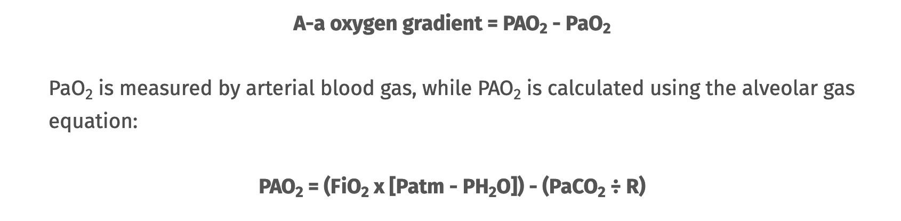
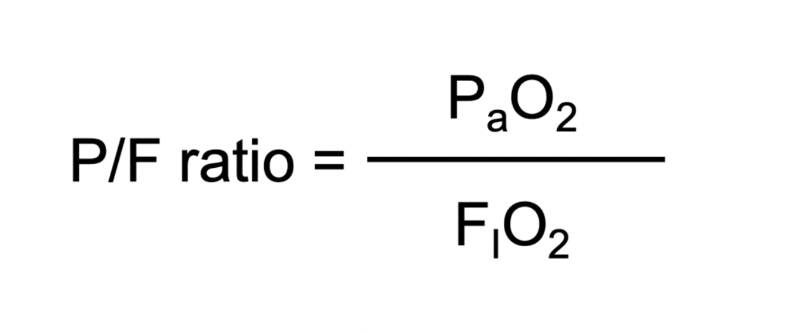
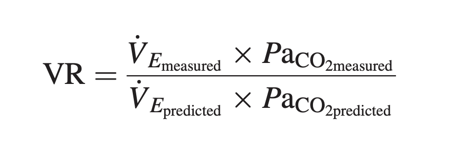

```{r setup, include=FALSE}
knitr::opts_chunk$set(echo = TRUE)
```

\


\

## Introduction

This document outlines the exploration of data from the Metavision Electronic Medical Record (EMR) in University Hospital Galway (UHG). The data comes from patients who were: 

- diagnosed with Covid-19
- admitted to the Intensive Care Unit (ICU) of UHG during the period 20/03/2020 - 22/09/2021
- underwent invasive ventilation
- were subject to the prone position while ventilated

The exploration requires the `tidyverse`, `lubridate`, `readxl`, `janitor`, and `DataEditR` packages.

```{r load_packages, include=FALSE}
library(tidyverse)
library(lubridate)
library(readxl)
library(janitor)
library(DataEditR)
```

\

### Data gathering

The data is gathered using the 'Metavision Query Wizard'. The query designed for this particular purpose captures all verified data on the system in the areas of:

- patient positioning
- ventilator settings
- cardiovascular measurements
- arterial blood gas values
- haematology blood tests
- biochemical blood tests

Unfortunately, there is no way to effectively query the amount of vasoactive agents that the patient is undergoing via infusion. It is possible to find out if a patient was receiving an infusion, but not the rate. To find this information, one must open each patient record through the normal clinically used interface and manually transcribe it.

\

#### 'Verified' data

The Query Wizard can select data from the servers along two key lines. That is, whether the data is 'verified' or 'not verified'. 'Verified' data has been reviewed and approved by a source outside the Metavision system. For most cardiovascular parameters, the nurse at the patient bedside approves a set of readings every hour that are accurate. They also manually enter the ABG data (the point-of-care analysers are not connected to Metavision but can be sourced). Other blood tests are integrated directly into Metavision, having been verified in the hospital laboratory.

Only cardiovascular data seems available in the 'unverified' form. This data is recorded once per minute. The Metavision Query Wizard crashes if one tries to access this data as it attempts to retrieve tens of thousands of pieces of data. It **can** be accessed through SQL queries, but overall this approach is hugely problematic for reasons that will not be covered here.

\

### Data wrangling

The Query Wizard outputs data as a _.xls_ file that is in an unwieldy format and is not conducive to data analysis. The initial phase of processing is to pass this _.xls_ file through a series of scripts that turn the records of each individual patient into a time-series. This processed data obeys the principles of 'tidy data' (Wickham 2014).

The scripts involved in these time series files are described [here](https://github.com/e05bf027/gas_efficiency/blob/main/Approach%20to%20wrangling.Rmd).

\

## Creating the proning data frame

### Basic assembly

The result is an hourly (or more, depending on manual inputs) time-series for each patient covering the patient's entire admission. We are interested in looking at the effects of the prone position. Therefore, we isolate a complete set of values for an ABG, and the ventilator settings that led to them, as close as is evident on the system:

- before a move to the prone position
- after a move to the prone position
- before the corresponding return to the supine position
- after the corresponding return to the supine position

We do this for each patient each time they are placed in the prone position. Due to small irregularities in the way the data is recorded, the easiest way to do this is to manually inspect and select these observations.

We can now load in the resulting _.xlsx_ file.

```{r load_xlsx, warning=FALSE}

path <- ('/Users/davidhannon/Documents/02. Medicine/Med_Programming/00. Patient DB/around_proning_for_ML/first_prone_GUH.xlsx')
prone_data <- read_xlsx(path = path, guess_max = 100)

head(prone_data)

```
\

### Coercing variables

Some variables must be coerced from characters to factors to optimize later analysis.

```{r coerce_variables}
prone_data$patient_id <- as.factor(prone_data$patient_id)
prone_data$gender <- as.factor(prone_data$gender)
prone_data$patient_positioning <- as.factor(prone_data$patient_positioning)
prone_data$proning_sequence <- as.factor(prone_data$proning_sequence)
prone_data$total_proning <- as.integer(prone_data$total_proning)
```

\

### Calculating new variables

The variables that we want to add to this dataframe are:

- Aa gradient
- PF ratio
- ca_o2
- mechanical power (delivered by ventilator)
- ventilatory ratio

\

#### A-a O2 gradient

Assesses for degree of shunting and V/Q mismatch. Calculated as follows:



However, I see versions which use PACO2, and PaCO2. I have included both:

```{r calc_aa_gradient}
prone_data <- prone_data %>% 
  mutate(aa_gradient_pAco2 = ((fi_o2 * (101.3 - 6.3)) - (end_tidal_co2_marquette / 0.8)) - pa_o2,
         aa_gradient_paco2 = ((fi_o2 * (101.3 - 6.3)) - (pa_co2 / 0.8)) - pa_o2)
```

\

#### PF ratio

Assesses lung function, particularly useful for intubated patients. Calculated using then following equation:



It is added as follows:

```{r calc_pfr}
prone_data <- prone_data %>% 
  mutate(pf_ratio = pa_o2 / fi_o2)
```

\


#### Arterial O2 content (Ca O2)

The arterial content of oxygen (Ca O2) gives the volume of oxygen carried in each 100ml of blood. It is calculated using the following equation.


```{r ca_o2}

prone_data <- prone_data %>% 
  mutate(ca_o2 = (1.34 * total_haemoglobin * (sa_o2_systemic/100)) + (0.0225 * pa_o2))

```


\

#### Mechanical power

Mechanical power is a difficult measure to calculate with the data we have available. There are approximately 5 ways to calculate mechanical power under volume control ventilation. Unfortunately, all of these methods require either peak flow (Vmax) or plateau pressure (PPlat). The available data does not have PPlat, and due to oversights in the connection between the PB ventilator and the Metavision servers, Vmax is always recorded as 0.

At present, this cannot be added though I am researching ways this might be achievable.

\

#### Ventilatory ratio

The ventilatory ratio (VR) compares actual measurements and predicted values of minute ventilation and PaCO2. It provides a unitless ratio that can be easily calculated at the bedside. VR is governed by carbon dioxide production and ventilatory efficiency in a logically intuitive way (Sinha 2009). The VR was originally proposed over a decade ago. In it's original form, the VR is calculated as follows:



In this equation, VR is the ventilatory ratio (where close to 1 is considered 'normal'), VE is *minute volume*, PaCO2 is the *partial pressure of CO2* given in an arterial blood gas (ABG). PaCO2 predicted is considered to be 5kPa.

In order to calculate this ratio, we must first calculate the predicted body weight (PBW) for the patient based on their height. PBW (kg) is calculated using the formula 50+0.91 (height – 152.4) for males, and 45.5+0.91 (height–152.4) for females (ARDSnet 2000).

```{r calculate_pbw}

# the df is split into male and female, the mutation applied to each table, and then the results combined
prone_m <- filter(prone_data, gender == 'm') %>% 
  mutate(predicted_weight = 50 + (0.91 * (height - 152.4)))

prone_f <- filter(prone_data, gender == 'f') %>% 
  mutate(predicted_weight = 45.5 + (0.91 * (height - 152.4)))

prone_data <- bind_rows(prone_f, prone_m) %>% 
  arrange(patient_id, obs_time)

# remove redundant dfs
rm(prone_m, prone_f, path)

```

\

Now that predicted body weights have been added, the ventilatory ratio can be calculated. This is displayed along with a small sample of the values we just added.

```{r ventilatory_ratio}

prone_data <- prone_data %>% 
  mutate(ventilatory_ratio = expiratory_tidal_volume_pb * pa_co2 / (100 * predicted_weight) * 5)

```

\

The result is a completed data frame with all parameters calculated to enable early analysis. A sample of these calculated variables is shown here.

```{r calculated_parameters, echo=FALSE}
head(select(prone_data,
            patient_id,
            time_since_adm,
            aa_gradient_pAco2, 
            pf_ratio,
            ca_o2,
            ventilatory_ratio
            )
)
```

\

## Description of the data


