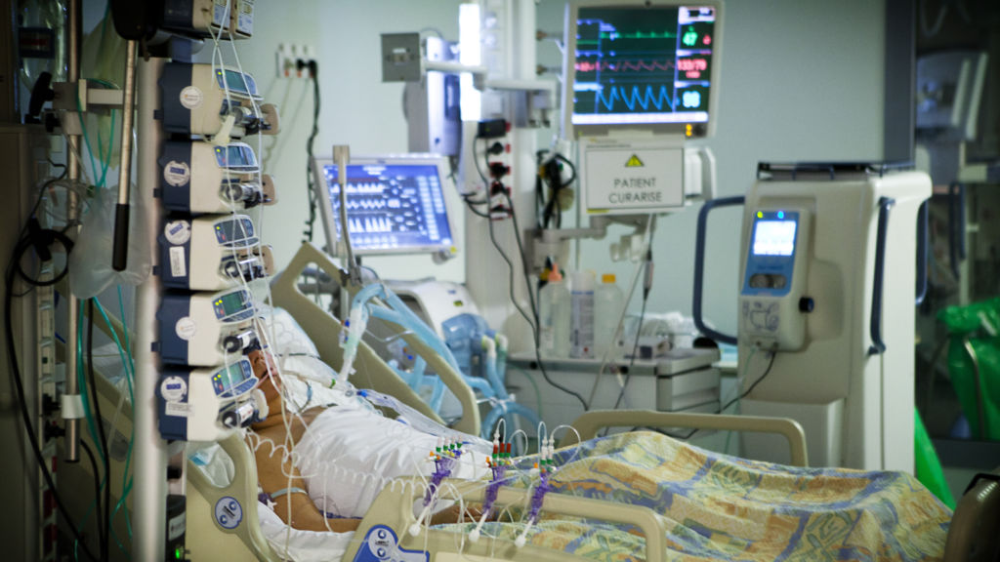
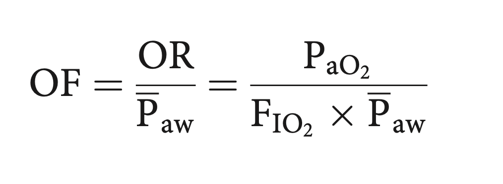
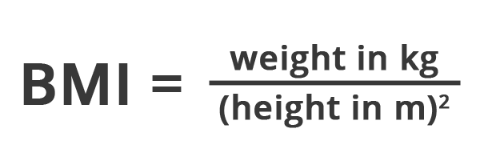

```{r setup, include=FALSE}
knitr::opts_chunk$set(echo = TRUE)

library(tidyverse)
library(lubridate)
library(readxl)
library(janitor)
library(DataEditR)
library(tableone)
library(gt)
library(gtsummary)
library(tableone)

```

\


\

## Introduction

This document outlines the exploration of data from the Metavision Electronic Medical Record (EMR) in University Hospital Galway (UHG). The data comes from patients who were: 

- diagnosed with Covid-19
- admitted to the Intensive Care Unit (ICU) of UHG during the period 20/03/2020 - 22/09/2021
- underwent invasive ventilation
- were subject to the prone position while ventilated

The exploration is performed using R 4.1.2 "Bird Hippie", and requires the `tidyverse`, `lubridate`, `readxl`, `janitor`, `gtsummary`, `gt` and `DataEditR` packages.

\

### Data gathering

The data is gathered using the 'Metavision Query Wizard'. The query designed for this particular purpose captures all verified data on the system in the areas of:

- patient positioning
- ventilator settings
- cardiovascular measurements
- arterial blood gas values
- haematology blood tests
- biochemical blood tests

Unfortunately, there is no way to effectively query the *amount* of vasoactive agents that the patient is undergoing via infusion using this Query Wizard. It is possible to find out *if* a patient was receiving an infusion, but not the rate. To find this information, one must open each patient record through the normal clinically used interface and manually transcribe it.

For each patient, we have recorded

- an ABG, ventilator settings, and cardiovascular readings within 3 hours of moving to the prone position
- the same observations within 3 hours post moving to the prone position
- the same observations within 3 hours of moving back to the supine position
- the same within 3 hours after returning to the supine position

\

#### What is 'verified' data?

The Query Wizard can select data from the servers along two key lines. That is, whether the data is 'verified' or 'not verified'. 'Verified' data has been reviewed and approved by a source outside the Metavision system. For most cardiovascular parameters, the nurse at the patient bedside approves a set of readings every hour that are accurate. They also manually enter the ABG data (the point-of-care analysers are not connected to Metavision but can be sourced). Other blood tests are integrated directly into Metavision, having been verified in the hospital laboratory.

Only cardiovascular data seems available in the 'unverified' form. This data is recorded once per minute. The Metavision Query Wizard crashes if one tries to access this data as it attempts to retrieve tens of thousands of pieces of data. It **can** be accessed through SQL queries, but overall this approach is hugely problematic for reasons that will not be covered here.

\

### Data wrangling

The Query Wizard outputs data as a _.xls_ file that is in an unwieldy format and is not conducive to data analysis. The initial phase of processing is to pass this _.xls_ file through a series of scripts that turn the records of each individual patient into a time-series. This processed data obeys the principles of 'tidy data' (Wickham 2014).

The scripts involved in these time series files are described [here](https://github.com/e05bf027/gas_efficiency/blob/main/Approach%20to%20wrangling.Rmd).

\

## Creating the proning data frame

### Basic assembly

The result is an hourly (or more, depending on manual inputs) time-series for each patient covering the patient's entire admission. We are interested in looking at the effects of the prone position. Therefore, we isolate a complete set of values for an ABG, and the ventilator settings that led to them, as close as is evident on the system:

- before a move to the prone position
- after a move to the prone position
- before the corresponding return to the supine position
- after the corresponding return to the supine position

We do this for each patient each time they are placed in the prone position. Due to small irregularities in the way the data is recorded, the easiest way to do this is to manually inspect and select these observations.

We can now load in the resulting _.xlsx_ file.

```{r load_xlsx, message=FALSE, warning=FALSE}

path <- ('/Users/davidhannon/Documents/02. Medicine/Med_Programming/00. Patient DB/around_proning_for_ML/first_prone_GUH.xlsx')
prone_data <- read_xlsx(path = path, guess_max = 100)

head(prone_data)

```
\

### Coercing variables

Some variables must be coerced from characters to factors to optimize later analysis.

```{r coerce_variables}
prone_data$patient_id <- as.factor(prone_data$patient_id)
prone_data$gender <- as.factor(prone_data$gender)
prone_data$outcome <- as.factor(prone_data$outcome)
prone_data$patient_positioning <- as.factor(prone_data$patient_positioning)
prone_data$proning_sequence <- factor(prone_data$proning_sequence, 
                                      levels = c('pre_prone',
                                                 'post_prone',
                                                 'pre_unprone',
                                                 'post_unprone'))
prone_data$location_preadmission <- as.factor(prone_data$location_preadmission)
prone_data$total_proning <- as.integer(prone_data$total_proning)
prone_data$proning_session <- as.integer(prone_data$proning_session)
```

\

### Calculating new variables

The variables that we want to add to this dataframe are:

- Aa gradient
- PF ratio
- Arterial blood O2 content 
- mechanical power (delivered by ventilator)
- ventilatory ratio
- BMI

\

#### A-a O2 gradient

Assesses for degree of shunting and V/Q mismatch. Calculated as follows:


However, I see versions which use PACO2, and PaCO2. I have included both:

```{r calc_aa_gradient, results='hide'}
prone_data <- prone_data %>% 
  mutate(aa_gradient_pAco2 = ((fi_o2 * (101.3 - 6.3)) - (end_tidal_co2_marquette / 0.8)) - pa_o2,
         aa_gradient_paco2 = ((fi_o2 * (101.3 - 6.3)) - (pa_co2 / 0.8)) - pa_o2)

round(prone_data$aa_gradient_pAco2, 1)
round(prone_data$aa_gradient_paco2, 1)
```

\

#### PF ratio

Assesses lung function, particularly useful for intubated patients. Calculated using then following equation:


It is added as follows:

```{r calc_pfr, results='hide'}
prone_data <- prone_data %>% 
  mutate(pf_ratio = pa_o2 / fi_o2)

round(prone_data$pf_ratio, 1)
```

\


#### Arterial O2 content (Ca O2)

The arterial content of oxygen (Ca O2) gives the volume of oxygen carried in each 100ml of blood. It is calculated using the following equation.


```{r ca_o2, results='hide'}

prone_data <- prone_data %>% 
  mutate(ca_o2 = (1.34 * total_haemoglobin * (sa_o2_systemic/100)) + (0.0225 * pa_o2))

round(prone_data$ca_o2, 1)

```


\

#### Mechanical power

Mechanical power is a difficult measure to calculate with the data we have available. There are approximately 5 ways to calculate mechanical power under volume control ventilation. Unfortunately, all of these methods require either peak flow (Vmax) or plateau pressure (PPlat). The available data does not have PPlat, and due to oversights in the connection between the PB ventilator and the Metavision servers, Vmax is always recorded as 0.

At present, this cannot be added though I am researching ways this might be achievable.

\

#### Ventilatory ratio (inc. predicted body weight)

The ventilatory ratio (VR) compares actual measurements and predicted values of minute ventilation and PaCO2. It provides a unitless ratio that can be easily calculated at the bedside. VR is governed by carbon dioxide production and ventilatory efficiency in a logically intuitive way (Sinha 2009). The VR was originally proposed over a decade ago. In it's original form, the VR is calculated as follows:


In this equation, VR is the ventilatory ratio (where close to 1 is considered 'normal'), VE is *minute volume*, PaCO2 is the *partial pressure of CO2* given in an arterial blood gas (ABG). PaCO2 predicted is considered to be 5kPa.

In order to calculate this ratio, we must first calculate the predicted body weight (PBW) for the patient based on their height. PBW (kg) is calculated using the formula 50+0.91 (height – 152.4) for males, and 45.5+0.91 (height–152.4) for females (ARDSnet 2000). When predicted body weights have been added, the ventilatory ratio can be calculated. This is displayed along with a small sample of the values we just added.

```{r calculate_pbw, include=FALSE, results='hide'}

# the df is split into male and female, the mutation applied to each table, and then the results combined
prone_m <- filter(prone_data, gender == 'm') %>% 
  mutate(predicted_weight = 50 + (0.91 * (height - 152.4)))

prone_f <- filter(prone_data, gender == 'f') %>% 
  mutate(predicted_weight = 45.5 + (0.91 * (height - 152.4)))

prone_data <- bind_rows(prone_f, prone_m) %>% 
  arrange(patient_id, obs_time)

round(prone_data$predicted_weight, 1)

# remove redundant dfs
rm(prone_m, prone_f, path)

```


```{r ventilatory_ratio, results='hide'}

prone_data <- prone_data %>% 
  mutate(ventilatory_ratio = expiratory_tidal_volume_pb * pa_co2 / (100 * predicted_weight) * 5)

round(prone_data$ventilatory_ratio, 2)

```

\

#### S/F ratio

The SpO2/FiO2 is an index of oxygenation that correlates with PF ratio (Rice et al 2007). It's advantage is that it can be calculated in the absence of an ABG.

```{r calculate_SF_ratio, results='hide'}

prone_data <- prone_data %>% 
  mutate(
    sf_ratio = sp_o2 / fi_o2
  )

round(prone_data$sf_ratio, 0)

```

\

#### Oxygenation index (OI)

The oxygenation index (OI) is commonly used to assess the severity of hypoxaemic respiratory failure and is commonly used in neonatal ICUs and can be used to inform decisions about patients who are candidates for Extra Corporeal Membrane Oxygenation. This index is considered a better indicator of lung injury compared to the PaO2/FiO2 ratio as it includes mean airway pressure (MAP).


```{r oxygenation_index, results='hide'}

# note: Paw * 0.74 converts cmH2O to mmHg
# pa_o2 * 7.5 converts kPa to mmHg
prone_data <- prone_data %>% 
  mutate(
    oxy_index = 
      (fi_o2 * 100) * (mean_airway_pressure_pb * 0.74) / (pa_o2 * 7.5)
  )

round(prone_data$oxy_index, 1)

```
\

#### PF/P ratio

Similar to PF ratio, but incorporating information about airway pressures as well (Palanidurai 2021).

```{r pfp_ratio, results='hide'}

# NB - I think the authors use imperial unitd but this is unclear
prone_data <- prone_data %>% 
  mutate(
    pfp_ratio = pa_o2 / fi_o2 * peep
  )

round(prone_data$pfp_ratio, 0)

```
\

#### Oxygenation Factor (OF)

Similar to the above, this measure was proposed initially as a way to reflect shunting in patients undergoing open heart surgery (El-Khatib 2004). It incorporates Paw and is a strong reflection of major ARDS mortality indicators such as mechanical power, driving pressure, and static lung compliance (El-Khabib 2020). As with the previous measure, this incorporates mechanical ventilation settings. In essence this measure 'normalizes' the PF ratio.

In theoretical terms, this is the measure available to me that feels the most promising. It is calculated with the following formula:



**Note that 'OR' = 'oxygenation ratio' = P/F ratio**

\

```{r of_ratio, results='hide'}

prone_data <- prone_data %>% 
  mutate(
    oxy_factor = pa_o2 / fi_o2 * mean_airway_pressure_pb
  )

round(prone_data$oxy_factor, 1)

```
\ 

#### Body Mass Index (BMI)

BMI offers the possibility of analyzing ventilatory parameters in the context of obesity. It is calculated using the formula below.



```{r bmi}

prone_data <- prone_data %>% 
  mutate(bmi = round(weight / (height/100)^2, 1))

```

\

### Result of calculations

The result is a completed data frame with all parameters calculated to enable early analysis. A sample of these calculated variables is shown here.

```{r calculated_parameters, echo=FALSE}
head(select(prone_data,
            patient_id,
            time_since_adm,
            bmi,
            aa_gradient_pAco2, 
            pf_ratio,
            ca_o2,
            ventilatory_ratio
            )
)
```

\

## Demographics

\

The table below summarizes the result of the data gathering and wrangling processes. As more data is gathered, the table will be subject to change. A total of 27 patients have been included in the dataset at present. There are many patients who were proned whilst awake, much less who were proned while fully invasively ventilated.

The following table describes the demographic characteristics of patients who were:

- diagnosed with Covid-19
- admitted to the Intensive Care Unit (ICU) of UHG during the period 20/03/2020 - 22/09/2021
- underwent invasive ventilation
- were subject to the prone position while ventilated

\


```{r isolate_summarise_population, echo=FALSE}

# isolate data concerning demographics
prone_data_pop <- prone_data %>%
  select(gender, 
         age, 
         weight, 
         height, 
         bmi, 
         # apache_ii, # ADD THIS AFTER NEXT UHG TRIP
         total_proning,
         location_preadmission,
         los, 
         outcome) %>% 
  distinct()

```


```{r tableone,  eval=FALSE, include=FALSE}

# create basic 'Table One', only a placeholder here as the 'gtsummary' method (next chunk) is better.

CreateTableOne(data = prone_data_pop) %>% 
  print(showAllLevels = TRUE)
```


```{r gtsummary_table_1_creation, include=FALSE}
# theme_gtsummary_journal(journal = "jama")
# Setting theme `JAMA`

theme_gtsummary_compact()
# Setting theme `Compact`

table_1 <- prone_data_pop %>% 
  tbl_summary(
    statistic = list(all_continuous() ~ "{mean} ({sd})",
                     all_categorical() ~ "{n} / {N} ({p}%)"),
    digits = all_continuous() ~ 1,
    label = list(gender ~ "Gender", 
                 age ~ "Age (years)",
                 weight ~ "Weight (kg)",
                 height ~ "Height (cm)",
                 bmi ~ "BMI",
                 # apache_ii ~ "Apache II",
                 total_proning ~ "Total proning sessions",
                 location_preadmission ~ "Admitting location",
                 los ~ "Length of stay (days)",
                 outcome ~ "Outcome")
  ) %>% 
  # modify_caption("**Table 1. Patient Characteristics**") %>% 
  bold_labels() %>% 
  modify_footnote(
    all_stat_cols() ~ "Mean (SD) or Frequency (%)
    "
  ) %>% 
  as_gt() %>% 
  gt::tab_source_note(gt::md("**NB APACHE II scores will be added shortly**"))

```

```{r table_1 display, echo=FALSE}

# code to display table one is a separate chunk as there is an unusual output whenever a theme is set `9as in the top of the above code chunk)
table_1
```

\

## Exploratory Analysis

### Surrogate markers for mechanical power

We will now examine and describe the data we have access to. Key to this is formulating interesting questions to ask the data.

My ideal is to examine how mechanical power changes throughout proning. Unfortunately, it is not possible to calculate this from the data in its current form. Peak inspiratory pressure (PIP) can be used as a way to examine changes between prone and supine positions, as can dynamic compliance (Cdyn). I will, therefore, look at how these change around prone positioning.

- does PIP decrease following/over the course of proning?
- does Cdyn increase following/over the course of proning?

\

#### Changes in Peak Inspiratory Pressure (PIP)

We can very roughly visualize PIP in the supine vs prone positions.

\

```{r pip_rough, echo=FALSE}

# create summary df
pip_prone_supine <- prone_data %>% 
  select(patient_positioning, 
         peak_inspiratory_pressure_measured_pb.x) %>%
  group_by(patient_positioning) %>% 
  summarise(pip_mean = mean(peak_inspiratory_pressure_measured_pb.x, na.rm = T),
            pip_sd = sd(peak_inspiratory_pressure_measured_pb.x, na.rm = T))

# create gt table
pip_prone_supine %>% rename(
  'PIP mean (cmH2O)' = pip_mean,
  'PIP SD (cmH2O)' = pip_sd,
  'Position' = patient_positioning
  ) %>% 
  gt() %>% 
  tab_header(
      title = md("**PIP in different positions**")
    ) %>% 
  cols_align(
    align = c('center'),
    columns = everything()
    ) %>% 
  cols_align(
    align = c('left'),
    columns = 'Position'
    ) %>% 
  fmt_number(
    columns = 2:3,
    decimals = 1
  ) %>% 
  tab_source_note(
    source_note = md("*Source: data described in Table 1*")
  )

```

\

There is essentially no difference between the prone and supine positions when examined this way, and when broken down further into the stages around proning this remains true.

\

```{r pip_by_stage, echo=FALSE}
# create summary df
pip_prone_supine <- prone_data %>% 
  select(proning_sequence, 
         peak_inspiratory_pressure_measured_pb.x) %>%
  group_by(proning_sequence) %>% 
  summarise(pip_mean = mean(peak_inspiratory_pressure_measured_pb.x, na.rm = T),
            pip_sd = sd(peak_inspiratory_pressure_measured_pb.x, na.rm = T))

# create gt table
pip_prone_supine %>% rename(
  'PIP mean (cmH2O)' = pip_mean,
  'PIP SD (cmH2O)' = pip_sd,
  'Proning stage' = proning_sequence
  ) %>% 
  gt() %>% 
  tab_header(
      title = md("**PIP in different positions**")
    ) %>% 
  cols_align(
    align = c('left'),
    columns = 'Proning stage'
  ) %>% 
  cols_align(
    align = c('center'),
    columns = 2:3
    ) %>% 
  fmt_number(
    columns = 2:3,
    decimals = 1
  ) %>% 
  tab_source_note(
    source_note = md("*Source: data described in Table 1*")
  )
```
\

We can conclude that PIP does **not meaningfully change around prone positioning** in this cohort.

\

#### Changes in Dynamic Compliance (Cdyn)

We will explore a similar exploration to that of PIP. We will begin by examining the changes at each stage.

\
```{r Cdyn_table, echo=FALSE, warning=FALSE}
# create summary df
cdyn_prone_supine <- prone_data %>% 
  select(proning_sequence, 
         dynamic_characteristics_pb) %>%
  group_by(proning_sequence) %>% 
  summarise(cdyn_mean = mean(dynamic_characteristics_pb, na.rm = T),
            cdyn_sd = sd(dynamic_characteristics_pb, na.rm = T))

# create gt table
cdyn_prone_supine %>% rename(
  'Cdyn mean (mL/cmH2O)' = cdyn_mean,
  'Cdyn SD (mL/cmH2O)' = cdyn_sd,
  'Proning stage' = proning_sequence
  ) %>% 
  gt() %>% 
  tab_header(
      title = md("**Cdyn in different positions**")
    ) %>% 
  cols_align(
    align = c('left'),
    columns = 'Proning stage'
  ) %>% 
  cols_align(
    align = c('center'),
    columns = 2:3
    ) %>% 
  fmt_number(
    columns = 2:3,
    decimals = 1
  ) %>% 
  tab_source_note(
    source_note = md("*Source: data described in Table 1*")
  )
```
\

There is a slightly greater change in the mean between pre and post proning. Graphically visualizing this data gives the following result.

```{r cdyn_plot, echo=FALSE, message=FALSE, warning=FALSE}
prone_data %>% 
  ggplot(
    mapping = aes(
      x = proning_sequence,
      y = dynamic_characteristics_pb
    )
  ) + 
  geom_boxplot(na.rm = T) +
  xlab('Position') +
  ylab('Cdyn (mL/cmH2O)') +
  theme_grey()

```


### Indices of oxygenation

There are several indices of oxygenation to examine in terms of how they change over the course of prone positioning. See more details at [Life In The Fast Lane](https://litfl.com/pao2-fio2-ratio/). These are:

- PF ratio
- Oxygen saturations in arterial blood (SpO2 and SaO2)
- S/F ratio (SpO2 to FiO2 ratio)
- PaO2 (arterial oxygen tension)
- A-a gradient (difference between alveolar oxygen tension (PAO2) and PaO2)
- Oxygenation index (OI) (the reciprocal of P/F times mean airway pressure (MAP)
- P/FP Ratio (PaO2/(FiO2 X PEEP)
- Respiratory index (RI) (RI = pO2(A-a)/pO2(a), ie. the A-a gradient divided by the PaO2; normal RI is <0.4)
- ventilatory ratio
- arterial O2 content (CaO2)


